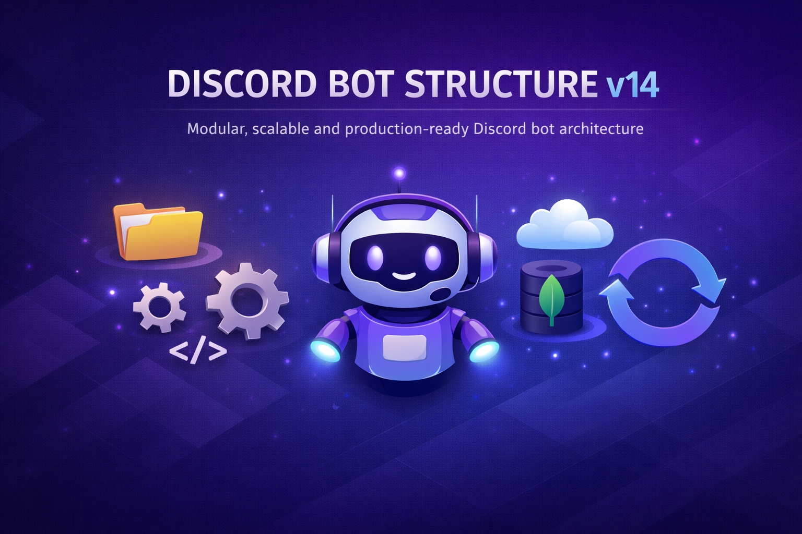

# Discord Bot Structure v14

<div align="center">




</div>

[To read in English, click here!](./README.md)

## Sobre o Projeto

O **Discord Bot Structure v14** é uma base de desenvolvimento modular e escalável para bots no Discord, construída com **discord.js v14** e **Node.js**. O objetivo é fornecer uma estrutura organizada, robusta e pronta para escalar, permitindo que o desenvolvedor foque na lógica do bot sem se preocupar com boilerplate.

A estrutura conta com carregamento automático de comandos e eventos via handlers dinâmicos, suporte a múltiplos ambientes (`development` / `production`) através de arquivos `.env` separados, integração opcional com **MongoDB** via Mongoose e um sistema de log colorido com **Chalk** para facilitar o debug no terminal.

## Features

| Recurso | Descrição |
|---|---|
| **Handlers automáticos** | Carregamento dinâmico de comandos e eventos via `commandHandler` e `eventHandler`, sem necessidade de importações manuais. |
| **Multi-ambiente** | Suporte nativo a `.env.development` e `.env.production`, alternando automaticamente conforme `NODE_ENV`. |
| **Validação de config** | Na inicialização, variáveis obrigatórias (`TOKEN`, `OWNER_ID`) são validadas; o processo encerra com mensagem clara se algo estiver faltando. |
| **Integração com MongoDB** | Conexão opcional via Mongoose. Se `MONGO_URI` não estiver definida, a aplicação sobe normalmente sem banco. |
| **Sistema de log colorido** | Logger com **Chalk** que distingue `[DEV]` e `[PRD]` com cores, além de níveis `info`, `success`, `warn` e `error`. |
| **Utilitários de mensagem** | `messageBuilder.js` centraliza a criação de **Embeds** e mensagens formatadas com emojis configuráveis. |
| **Controle de comandos** | Cada comando suporta os campos `ownerOnly`, `enabled` e `cooldown`, com checagem automática no `interactionCreate`. |
| **Deploy de Slash Commands** | Script dedicado `deploy-commands.js` para registrar os comandos na API do Discord antes de subir o bot. |

## Arquitetura

O fluxo parte do `app.js`, que delega para o `src/index.js`. Este inicializa o client, conecta ao MongoDB e dispara os handlers para registrar comandos e eventos dinamicamente.

```
app.js
  └── src/index.js
        ├── loadConfig()         → Carrega .env baseado em NODE_ENV
        ├── connectMongo()       → Conecta ao MongoDB (opcional)
        ├── loadEvents(client)   → Varre src/events/**/*.js e registra listeners
        └── loadCommands(client) → Varre src/commands/**/*.js e popula client.commands
              │
              └── interactionCreate (event)
                    ├── Verifica ownerOnly / enabled
                    ├── Trata erros com reply/followUp seguro
                    └── command.execute(interaction, client)
```

Quando um usuário usa um Slash Command, o evento `interactionCreate` recupera o comando da `Collection`, aplica as validações (`ownerOnly`, `enabled`) e executa o handler correspondente. Erros são capturados individualmente, sem derrubar o processo.

## Tecnologias Utilizadas

- **[discord.js](https://discord.js.org/) `^14.24.2`**: biblioteca principal para interação com a API do Discord; fornece o `Client`, `GatewayIntentBits`, `SlashCommandBuilder`, `Collection` e utilitários de permissão.
- **[mongoose](https://mongoosejs.com/) `^8.19.3`**: ODM para MongoDB, utilizado para modelagem e persistência de dados.
- **[dotenv](https://github.com/motdotla/dotenv) `^17.2.3`**: carregamento de variáveis de ambiente a partir de arquivos `.env.*` específicos por ambiente.
- **[chalk](https://github.com/chalk/chalk) `^5.6.2`**: formatação colorida de logs no terminal; usado pelo `logger.js` para distinguir níveis e ambientes visualmente.
- **[cross-env](https://github.com/kentcdodds/cross-env) `^10.1.0`**: define `NODE_ENV` de forma portável nos scripts npm, garantindo compatibilidade entre Windows, Linux e macOS.

## Instalação

Pré-requisitos:

- **Node.js** `>= 18.0.0`
- **npm** `>= 8.0.0`
- Uma aplicação Discord criada no [Discord Developer Portal](https://discord.com/developers/applications) com bot token gerado, as intents necessárias habilitadas e bot adicionado ao servidor com os escopos `bot` e `applications.commands`.

```bash
git clone https://github.com/giovannipereiradev/discord-bot-structure-v14.git
cd discord-bot-structure-v14
npm install
```

## Configuração

Crie os arquivos de ambiente na raiz do projeto:

**`.env.development`**
```env
NODE_ENV=development
TOKEN=seu_token_de_desenvolvimento
MONGO_URI=mongodb://localhost:27017/meu-bot-dev
OWNER_ID=seu_discord_user_id
CLIENT_ID=id_da_aplicacao
GUILD_ID=id_do_servidor_de_testes
```

**`.env.production`**
```env
NODE_ENV=production
TOKEN=seu_token_de_producao
MONGO_URI=sua_string_mongodb_atlas
OWNER_ID=seu_discord_user_id
CLIENT_ID=id_da_aplicacao
```

| Variável | Obrigatória | Descrição |
|---|---|---|
| `TOKEN` | Sim | Token do bot obtido no Discord Developer Portal. |
| `OWNER_ID` | Sim | ID do usuário Discord dono do bot. Usado para comandos `ownerOnly`. |
| `CLIENT_ID` | Deploy | ID da aplicação. Necessário para o `deploy-commands.js`. |
| `GUILD_ID` | Dev | ID do servidor de testes. Omitir registra comandos globalmente. |
| `MONGO_URI` | Não | String de conexão do MongoDB. Se ausente, o bot sobe sem banco. |

## Estrutura de Pastas

```
discord-bot-structure-v14/
│
├── app.js                      # Ponto de entrada
├── config.js                   # Carregamento e validação do .env
├── package.json
│
├── .env.development             # Variáveis para ambiente de desenvolvimento (não versionar)
├── .env.production              # Variáveis para ambiente de produção (não versionar)
│
└── src/
    ├── index.js                 # Instancia o Client Discord e carrega events/commands
    ├── deploy-commands.js       # Registra Slash Commands na API do Discord
    │
    ├── commands/                # Slash commands organizados por categoria
    │   ├── admin/               # Comandos exclusivos para administradores
    │   └── utils/
    │       └── ping.js          # /ping - verifica latência do bot
    │
    ├── events/                  # Handlers de eventos Discord agrupados por escopo
    │   ├── client/
    │   │   └── clientReady.js   # Dispara ao bot ficar online
    │   └── guild/
    │       └── interactionCreate.js  # Despacha slash commands; valida ownerOnly e enabled
    │
    ├── handlers/                # Lógica central de carregamento e processamento
    │   ├── commandHandler.js    # Carrega comandos dinamicamente para client.commands
    │   ├── eventHandler.js      # Registra eventos dinamicamente no client
    │   └── mongoHandler.js      # Gerencia a conexão com o MongoDB
    │
    ├── services/
    │   └── logger.js            # Log colorido com chalk (INFO/SUCCESS/WARN/ERROR + env)
    │
    └── utils/
        ├── config.json          # Configurações estáticas (cor padrão de embeds, emojis)
        └── messageBuilder.js    # Fábrica de mensagens formatadas e embeds
```

## Como Usar

```bash
# Ambiente de desenvolvimento
npm run dev

# Ambiente de produção
npm start
```

**Adicionando um novo slash command**

Crie um arquivo `.js` na pasta de categoria dentro de `src/commands/` e reinicie o bot. O `commandHandler.js` e o `deploy-commands.js` detectam e registram automaticamente.

```js
// src/commands/utils/meuComando.js
import { SlashCommandBuilder, PermissionFlagsBits } from 'discord.js';

export default {
  data: new SlashCommandBuilder()
    .setName('meu-comando')
    .setDescription('Descrição do comando.')
    .setDefaultMemberPermissions(PermissionFlagsBits.SendMessages),

  category: 'utils',
  cooldown: 5,
  ownerOnly: false,
  enabled: true,

  async execute(interaction, client) {
    await interaction.reply({ content: '✅ Funcionou!', ephemeral: true });
  }
};
```

**Adicionando um novo evento**

Crie um arquivo `.js` dentro de `src/events/client/` ou `src/events/guild/`. O nome do arquivo deve ser exatamente o nome do evento Discord (ex: `guildMemberAdd.js`). O `eventHandler.js` registra automaticamente ao reiniciar.

```js
// src/events/guild/guildMemberAdd.js
import { log } from '../../services/logger.js';

export default async (member, client) => {
  log.info(`Novo membro: ${member.user.tag}`);
};
```

## Licença

Distribuído sob a licença MIT. Veja o arquivo [LICENSE](LICENSE) para mais detalhes.

<div align="center">
  Desenvolvido por <a href="https://giovannitavares.com">Giovanni Tavares</a>
</div>
